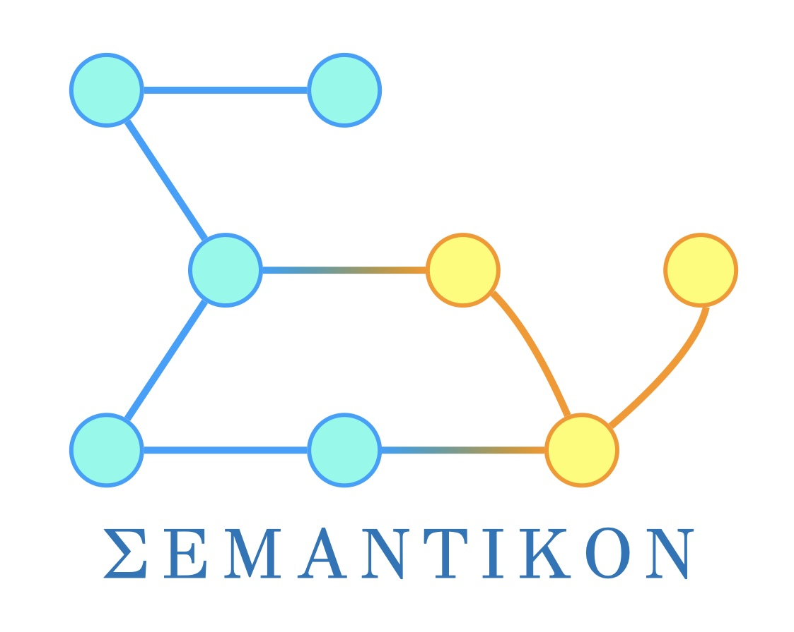

# semantikon

[](https://github.com/pyiron/semantikon/actions/workflows/push-pull.yml)
[](https://codecov.io/gh/pyiron/semantikon)




## Motivation

Let's take a look at the following function:

```python
def get_speed(distance: float, time: float) -> float:
    speed = distance / time
    return speed
```

For you as a human, it is clear that this is a function to calculate the speed for a given distance and a time. But for a computer, it is just a function that takes two floats and returns a float. The computer does not know what the inputs and outputs mean. This is where `semantikon` comes in. It provides a way to give scientific context to the inputs and outputs, as well as to the function itself.


## Installation

You can install `semantikon` via `pip`:

```bash
pip install semantikon
```

You can also install `semantikon` via `conda`:

```bash
conda install -c conda-forge semantikon
```

## Quick insight

In the realm of the workflow management systems, there are well defined inputs and outputs for each node. `semantikon` is a Python package to give scientific context to python functions by type annotations and decorators, which can then be translated into an `rdflib` knowledge graph. `semantikon` utilizes [PMD core ontology](https://materialdigital.github.io/core-ontology/) (PMDco), which is based on the [Basic Formal Ontology](https://basic-formal-ontology.org/) (BFO) and [Ontology for Biomedical Investigations](https://obi-ontology.org/) (OBI).

`semantikon` provides a way to define types for input and output parameters for function via type hinting. Type hinting is done with the function `u`, which **requires** the type, and **optionally** you can define ontological metadata. The type hinting is done in the following way:

```python
>>> from rdflib import Namespace
>>> from semantikon import meta, u
>>>
>>> EX = Namespace("http://example.org/")
>>>
>>> def get_speed(
...     distance: u(float, uri=EX.distance, units="meter"),
...     time: u(float, uri=EX.time, units="second"),
... ) -> u(float, uri=EX.speed, units="meter/second", label="speed"):
...     """some random docstring"""
...     speed = distance / time
...     return speed
>>> 
>>> 
>>> @meta(uri=EX.get_kinetic_energy)
>>> def get_kinetic_energy(
...     mass: u(float, {"units": "kilogram", "uri": EX.Mass}),
...     velocity: u(float, {"units": "meter/second", "uri": EX.Velocity}),
... ) -> u(float, {"units": "joule", "uri": EX.KineticEnergy}):
...     return 0.5 * mass * velocity**2
>>> 
>>> 
>>> def my_kinetic_energy_workflow(
...     distance, time, mass
... ):
...     speed = get_speed(distance, time)
...     kinetic_energy = get_kinetic_energy(mass, speed)
...     return kinetic_energy

```

The `workflow` decorator from `semantikon.workflow` allows you to define a workflow that uses the above functions in semantikon. You can use any workflow management system that can export the workflow in the [`flowrep`](https://github.com/pyiron/flowrep)-format. Via `semantikon.get_knowledge_graph` you can extract a knowledge graph from the workflow. The knowledge graph schematically has the following structure:

```mermaid
graph TD
    get_speed[get_speed (obi:planned_process)] -- bfo:has_part -- speed[speed (pmdco:output_assignmen5)]
    speed -- pmdco:has_specified_output --> speed_data[speed_data (obi:value_specification)]
    speed_data -- obi:specifies_value_of --> EX.speed
    speed_data -- qudt:hasUnit --> meter[meter (qudt:unit)]
    velocity -- pmdco:has_specified_input --> speed_data
    get_kinetic_energy[get_kinetic_energy (obi:planned_process)] -- bfo:has_part -- velocity[velocity (pmdco:input_assignment)]
```

This is only the first insight into the knowledge graph. You can find the details in the [notebook](../notebooks/knowledge_graph.ipynb) in the `notebooks` folder.

You can also type-hint the inputs and outputs of a function using a class, i.e.:

```python
>>> from semantikon.converter import dataclass
>>> from semantikon import u
>>> from rdflib import Namespace
>>>
>>> EX = Namespace("http://example.org/")
>>>
>>> @dataclass
... class MyRecord:
...     distance: u(float, units="meter", uri=EX.distance)
...     time: u(float, units="second", uri=EX.time)
...     result: u(float, units="meter/second", label="speed", uri=EX.speed)
>>>
>>> def get_speed(distance: MyRecord.distance, time: MyRecord.time) -> MyRecord.result:
...     speed = distance / time
...     return speed

```

This is equivalent to the previous example. Moreover, if you need to modify some parameters, you can use `u` again, e.g. `u(MyRecord.distance, units="kilometer")`.

### Side tour: unit conversion with `pint`

This part has nothing to do with the knowledge graph, but `semantikon` provides a way to interpret the types of inputs and outputs of a function via a decorator, in order to check consistency of the types and to convert them if necessary. Currently, `semantikon` provides an interpreter for `pint.UnitRegistry` objects. The interpreter is applied in the following way:

```python
>>> from semantikon.metadata import u
>>> from semantikon.converter import units
>>> from pint import UnitRegistry
>>>
>>> @units
... def get_speed(
...     distance: u(float, units="meter"),
...     time: u(float, units="second")
... ) -> u(float, units="meter/second", label="speed"):
...     speed = distance / time
...     return speed
>>>
>>> ureg = UnitRegistry()
>>>
>>> print(get_speed(1 * ureg.meter, 1 * ureg.second))
1.0 meter / second

```

The interpreters check all types and, if necessary, convert them to the expected types **before** the function is executed, in order for all possible errors would be raised before the function execution. The interpreters convert the types in the way that the underlying function would receive the raw values.

In case there are multiple outputs, the type hints are to be passed as a tuple (e.g. `tuple[u(float, "meter"), u(float, "second"))`).

It is not fully guaranteed as a feature, but relative units as given [on this page](https://pint.readthedocs.io/en/0.10.1/wrapping.html#specifying-relations-between-arguments) can be also used.

Interpreters can distinguish between annotated arguments and non-annotated arguments. If the argument is annotated, the interpreter will try to convert the argument to the expected type. If the argument is not annotated, the interpreter will pass the argument as is.

Regardless of whether type hints are provided, the interpreter acts only when the input values contain units and ontological types. If the input values do not contain units and ontological types, the interpreter will pass the input values to the function as is.


## License

This project is licensed under the BSD 3-Clause License - see the [LICENSE](../LICENSE) file for details.

Copyright (c) 2025, Max-Planck-Institut für Nachhaltige Materialien GmbH - Computational Materials Design (CM) Department
