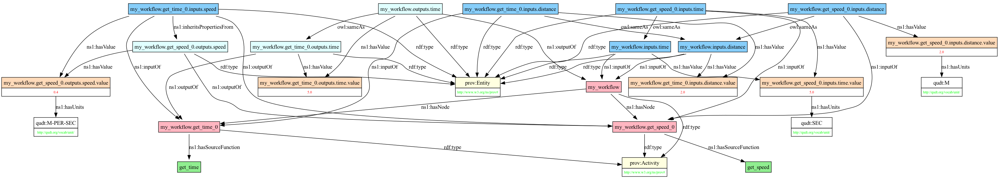

# semantikon

[](https://github.com/pyiron/semantikon/actions/workflows/push-pull.yml)
[](https://codecov.io/gh/pyiron/semantikon)


## Motivation

Let's take a look at the following function:

```python
def get_speed(distance: float, time: float) -> float:
    return distance / time
```

For you as a human, it is clear that this is a function to calculate the speed for a given distance and a time. But for a computer, it is just a function that takes two floats and returns a float. The computer does not know what the inputs and outputs mean. This is where `semantikon` comes in. It provides a way to give scientific context to the inputs and outputs, as well as to the function itself.


## Installation

You can install `semantikon` via `pip`:

```bash
pip install semantikon
```

You can also install `semantikon` via `conda`:

```bash
conda install -c conda-forge semantikon
```

## Overview

In the realm of the workflow management systems, there are well defined inputs and outputs for each node. `semantikon` is a Python package to give scientific context to node inputs and outputs by providing type hinting and interpreters. Therefore, it consists of two **fully** separate parts: type hinting and interpreters.

### **Type hinting**

`semantikon` provides a way to define types for any number of input parameters and any number of output values for function via type hinting, in particular: data type, unit and ontological type. Type hinting is done with the function `u`, which **requires** the type, and **optionally** you can define the units and the ontological type. The type hinting is done in the following way:

```python
>>> from semantikon.metadata import u
>>> from rdflib import Namespace
>>>
>>> EX = Namespace("http://example.org/")
>>>
>>> def get_speed(
...     distance: u(float, units="meter", uri=EX.distance),
...     time: u(float, units="second", uri=EX.time),
... ) -> u(float, units="meter/second", label="speed", uri=EX.speed):
...     return distance / time

```

`semantikon`'s type hinting does not require to follow any particular standard. It only needs to be compatible with the interpreter applied (s. below).

You can also type-hint the inputs and outputs of a function using a class, i.e.:

```python
>>> from semantikon.metadata import u
>>> from semantikon.converter import semantikon_class
>>> from rdflib import Namespace
>>>
>>> EX = Namespace("http://example.org/")
>>>
>>> @semantikon_class
... class MyRecord:
...     distance: u(float, units="meter", uri=EX.distance)
...     time: u(float, units="second", uri=EX.time)
...     result: u(float, units="meter/second", label="speed", uri=EX.speed)
>>>
>>> def get_speed(distance: MyRecord.distance, time: MyRecord.time) -> MyRecord.result:
...     return distance / time

```

This is equivalent to the previous example. Moreover, if you need to modify some parameters, you can use `u` again, e.g. `u(MyRecord.distance, units="kilometer")`.

### **Interpreters**

Interpreters are wrappers or decorators that inspect and process type-hinted metadata at runtime.

#### General interpreter

In order to extract argument information, you can use the functions `parse_input_args` and `parse_output_args`. `parse_input_args` parses the input variables and return a dictionary with the variable names as keys and the variable information as values. `parse_output_args` parses the output variables and returns a dictionary with the variable information if there is a single output variable, or a list of dictionaries if it is a tuple.

Example:

```python
>>> from semantikon.metadata import u
>>> from semantikon.converter import parse_input_args, parse_output_args
>>> from rdflib import Namespace
>>>
>>> EX = Namespace("http://example.org/")
>>>
>>> def get_speed(
...     a: u(float, units="meter", uri=EX.distance),
...     b: u(float, units="second", uri=EX.time),
... ) -> u(float, units="meter/second", label="speed", uri=EX.speed):
...     return a / b
>>>
>>> print(dict(sorted({k: dict(sorted(v.items())) for k, v in parse_input_args(get_speed).items()}.items())))
{'a': {'dtype': <class 'float'>, 'units': 'meter', 'uri': rdflib.term.URIRef('http://example.org/distance')}, 'b': {'dtype': <class 'float'>, 'units': 'second', 'uri': rdflib.term.URIRef('http://example.org/time')}}

>>> print(dict(sorted(parse_output_args(get_speed).items())))
{'dtype': <class 'float'>, 'label': 'speed', 'units': 'meter/second', 'uri': rdflib.term.URIRef('http://example.org/speed')}

```

#### Unit conversion with `pint`

`semantikon` provides a way to interpret the types of inputs and outputs of a function via a decorator, in order to check consistency of the types and to convert them if necessary. Currently, `semantikon` provides an interpreter for `pint.UnitRegistry` objects. The interpreter is applied in the following way:

```python
>>> from semantikon.metadata import u
>>> from semantikon.converter import units
>>> from pint import UnitRegistry
>>>
>>> @units
... def get_speed(
...     a: u(float, units="meter"),
...     b: u(float, units="second")
... ) -> u(float, units="meter/second", label="speed"):
...     return a / b
>>>
>>> ureg = UnitRegistry()
>>>
>>> print(get_speed(1 * ureg.meter, 1 * ureg.second))
1.0 meter / second

```

The interpreters check all types and, if necessary, convert them to the expected types **before** the function is executed, in order for all possible errors would be raised before the function execution. The interpreters convert the types in the way that the underlying function would receive the raw values.

In case there are multiple outputs, the type hints are to be passed as a tuple (e.g. `tuple[u(float, "meter"), u(float, "second"))`).

It is not fully guaranteed as a feature, but relative units as given [on this page](https://pint.readthedocs.io/en/0.10.1/wrapping.html#specifying-relations-between-arguments) can be also used.

Interpreters can distinguish between annotated arguments and non-anotated arguments. If the argument is annotated, the interpreter will try to convert the argument to the expected type. If the argument is not annotated, the interpreter will pass the argument as is.

Regardless of whether type hints are provided, the interpreter acts only when the input values contain units and ontological types. If the input values do not contain units and ontological types, the interpreter will pass the input values to the function as is.


#### Knowledge graph

Based on the type hints, `semantikon` can create a knowledge graph of the function. The knowledge graph is a directed acyclic graph (DAG) that contains the inputs and outputs of the function, as well as the units and ontological types.

```python
>>> from semantikon.metadata import u
>>> from semantikon.workflow import get_workflow_dict
>>> from semantikon.ontology import get_knowledge_graph
>>>
>>>
>>> def get_speed(distance: u(float, units="meter"), time: u(float, units="second")) -> u(float, units="meter/second"):
...     speed = distance / time
...     return speed
>>> 
>>> def get_time(distance, speed):
...     time = distance / speed
...     return time
>>> 
>>> def my_workflow(distance, time):
...     speed = get_speed(distance, time)
...     time = get_time(distance, speed)
...     return time
>>> graph = get_knowledge_graph(get_workflow_dict(my_workflow))

```

This creates an `rdflib`-graph, which you can visualize with the programme of your choice. If you use `semantikon.visualize.visualize`,  you can get the following figure:




#### Check node compatibility

There are multiple packages which are able to check class compatibility of nodes. On top of this, `semantikon` can also check the compatibility of nodes going all the way through the history of the output. Let's take the following example:

```python
>>> class Clothes:
...     cleaned = False
...     color = "white"
>>>
>>> def wash(clothes: Clothes) -> Clothes:
...     clothes.cleaned = True
...     return clothes
>>>
>>> def dye(clothes: Clothes, color="blue") -> Clothes:
...     clothes.color = color
...     return clothes
>>>
>>> def sell(clothes: Clothes) -> int:
...     return 10

```

As a good vendor, you would like to make sure that you sell clothes only if it has been dyed and cleaned. On the other hand, each of the nodes (`wash` and `dye`) is only aware of what itself is doing, but not whether the other function has been executed beforehand. For this, the argument `triples` comes in handy, which you can use in the form:

```python
>>> def wash(clothes: clothes) -> u(Clothes, triples=(EX.hasProperty, EX.cleaned)):
...    clothes.cleaned = True
...    return clothes

```

You can see a double, because `semantikon` automatically adds the argument itself as the subject, i.e. in this case the triple will translated to `wash.outputs.clothes` - `EX:hasProperty` - `EX:cleaned`. With this, you can give the full ontological information via:

```python
>>> from rdflib import Namespace, OWL
>>> from semantikon.metadata import u
>>> from semantikon.workflow import get_workflow_dict
>>> from semantikon.ontology import get_knowledge_graph, SNS, validate_values
>>>
>>> EX = Namespace("http://www.example.org/")
>>>
>>> class Clothes:
...     cleaned = False
...     color = "white"
>>>
>>> def wash(clothes: Clothes) -> u(Clothes, triples=((SNS.inheritsPropertiesFrom, "inputs.clothes"), (EX.hasProperty, EX.cleaned))):
...     clothes.cleaned = True
...     return clothos
>>>
>>> def dye(clothes: Clothes, color="blue") -> u(Clothes, triples=((SNS.inheritsPropertiesFrom, "inputs.clothes"), (EX.hasProperty, EX.color))):
...     clothes.color = color
...     return clothes
>>>
>>> def sell(
...     clothes: u(
...         Clothes, restrictions=(
...             ((OWL.onProperty, EX.hasProperty), (OWL.someValuesFrom, EX.cleaned)), ((OWL.onProperty, EX.hasProperty), (OWL.someValuesFrom, EX.color))
...         )
...     )
... ) -> int:
...     return 10
>>>
>>> def my_correct_workflow(clothes: Clothes) -> int:
...     clothes = dye(clothes)
...     clothes = wash(clothes)
...     money = sell(clothes)
...     return money
>>>
>>> graph = get_knowledge_graph(get_workflow_dict(my_correct_workflow))
>>> print(validate_values(graph))
[]

>>> def my_wrong_workflow(clothes: Clothes) -> int:
...     clothes = wash(clothes)
...     money = sell(clothes)
...     return money
>>>
>>> graph = get_knowledge_graph(get_workflow_dict(my_wrong_workflow))
>>> print(validate_values(graph))
[(rdflib.term.URIRef('my_wrong_workflow.dye_0.inputs.clothes'),
  rdflib.term.URIRef('http://example.org/hasProperty'),
  rdflib.term.URIRef('http://example.org/color'))]

```

So in the first case, `validate_values` returns an empty list, because there is nothing missing, but in the second case, `dye(clothes)` was missing, because of which `validate_values` was returning the triple which it was expecting.

On top of this, you might also want to make sure that the clothes are dyed first and then washed. In other words, when you dye the clothes, washing becomes invalid. For this, you can use the argument `cancel`, via:

```python
>>> def dye(clothes: Clothes, color="blue") -> u(
...     Clothes,
...     triples=((SNS.inheritsPropertiesFrom, "inputs.clothes"), (EX.hasProperty, EX.color)),
...     cancel=(EX.hasProperty, EX.cleaned)
... ):
...     clothes.color = color
...     return clothes

```

And you can do the validation as before.

Instead of OWL restrictions, you can also use shacl constraints from `rdflib`. In this case, instead of `OWL.onProperty`, you can use `SH.path` and instead of `OWL.someValuesFrom`, you can use `SH.hasValue`. The rest is the same.

## License

This project is licensed under the BSD 3-Clause License - see the [LICENSE](../LICENSE) file for details.

Copyright (c) 2025, Max-Planck-Institut für Nachhaltige Materialien GmbH - Computational Materials Design (CM) Department
