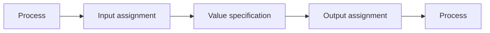

# Specs

## semantikon representation

The semantikon representation of a workflow is a **nested dictionary** with the following entries on the top level (which is the main workflow level):

- `label` (required): Name of the workflow
- `inputs` (required): Input arguments and their metadata (see below)
- `outputs` (required): Output arguments and their metadata (see below)
- `nodes` (required): Atomic nodes or nested workflows (see below)
- `edges` (required): Edge connections of the nodes (see below)
- `type` (required): It must be "Workflow" (otherwise "Function" for the atomic nodes)
- `function` (optional): The underlying python function and its metadata (see below)

The input and output arguments must be given by a dictionary whose key is the argument name in the case of the input, and a label in the case of the output. The value must be given by a dictionary, which can in principle contain anything (or nothing). Following arguments can be currently understood by `semantikon` (all optional):

- `value`: Literal value of the argument
- `dtype`: Data type; currently this has no meaning for `semantikon` except for data classes
- `uri`: URIRef of what the argument represents (must be a class)
- `triples`: A double, a triple or a list/tuple of doubles or triples. See below for the syntax
- `restrictions`: owl-type restrictions. See below for the syntax
- `units`: QUDT URI or str that can be understood by pint (and will be later translated to pint URI)
- `derived_from`: To indicate that (typically) an output is derived from an input. For example painting a car where the output is basically the same car as the input with a different color.

An atomic node is represented by a dictionary whose key represents the name of the node and the value is given by a dictionary containing the following arguments:

- `inputs` (required): Input arguments and their metadata (see above)
- `outputs` (required): Output arguments and their metadata (see above)
- `type` (required): "Function" for an atomic node
- `function` (required): Underlying python function (note: **required** for an atomic node)

## Knowledge graph

A knowledge graph generated by `semantikon` is based on the [PMD Core Ontology](https://materialdigital.github.io/core-ontology/) (PMDco) which is derived from the [Basic Formal Ontology](https://basic-formal-ontology.org) (BFO). `semantikon` exports a knowledge graph in the `rdflib.Graph` format, which contains the A-box (execution graph), T-box (recipe) or both of them. In particular, each workflow recipe dynamically defines a T-box. Each class in the T-box has the namespace `http://pyiron.org/ontology` (subject to change). The knowledge graph contains the following nodes:

- **Process** (`http://purl.obolibrary.org/obo/BFO_0000015`): A workflow node, applied to both workflows and atomic nodes
- **Input assignment** (`https://w3id.org/pmd/co/PMD_0000066`): Input port of a node, i.e. input argument in the sense of python. This node only specifies which argument, but does not contain any metadata (such as value, datatype etc.)
- **Output assignment** (`https://w3id.org/pmd/co/PMD_0000066`): Analogous to input assignment
- **Value specification** (`http://purl.obolibrary.org/obo/OBI_0001933`): Data node attached to an input and/or output assignment. This node contains all the metadata attached to the input and output ports, such as value, URI, ontological triples, restrictions etc.

